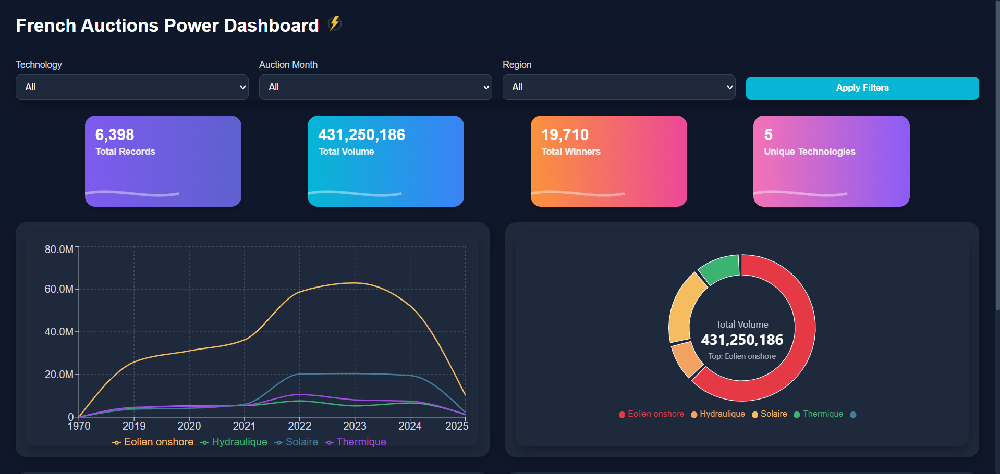
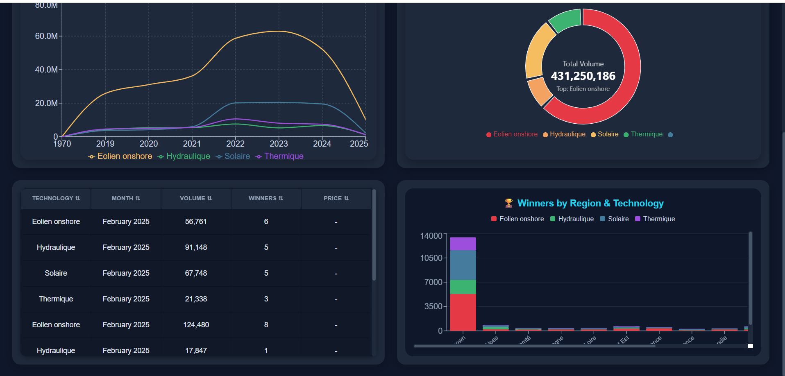
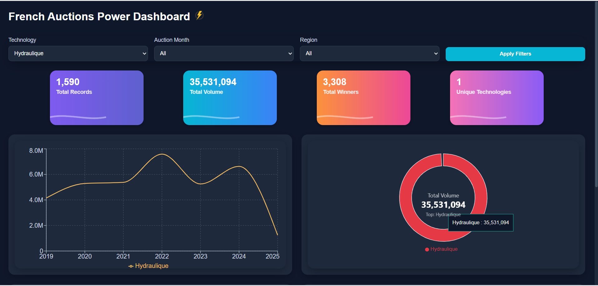
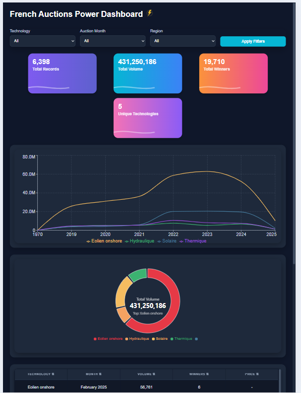
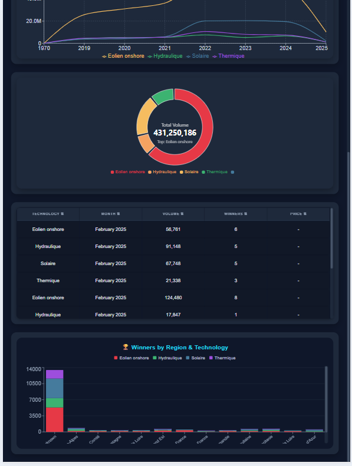
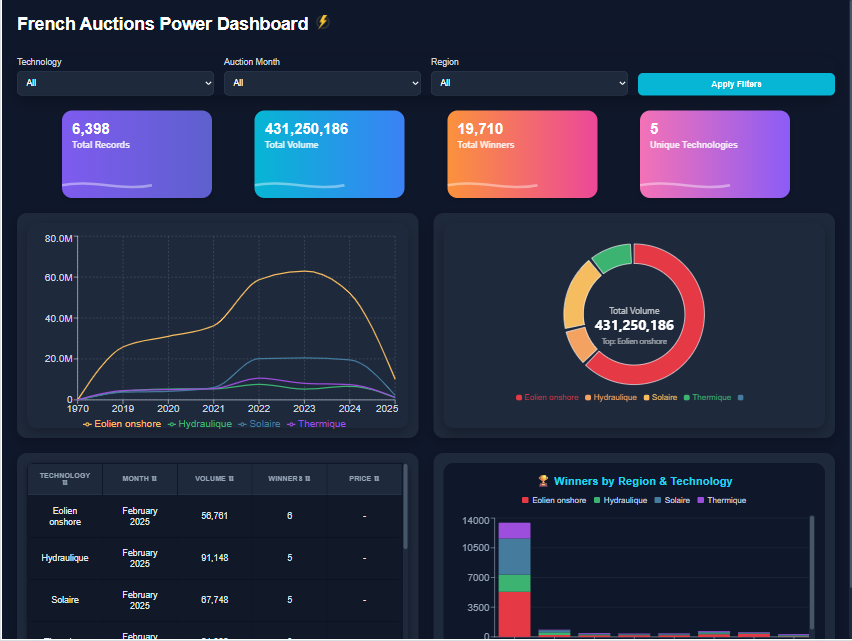
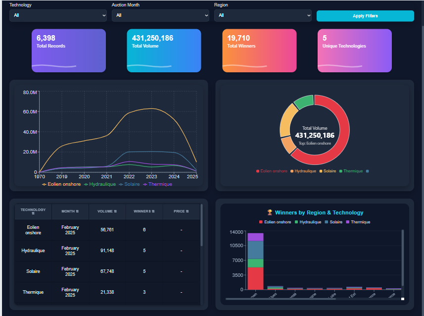

# ⚡️ French Auctions Power Data Platform

A complete solution for collecting, storing, and visualizing French Power Auction data.

> **Includes:**
>
> - [Backend: EEX Auction Data REST API & ETL Pipeline](./backend/README.md)
> - [Frontend: Power Auction Dashboard](./frontend/README.md)

---

## 🏠 Project Overview

This monorepo contains both backend and frontend for managing and visualizing French Power Auctions.

- **Automated ETL**: Extract, transform, and load auction data from EEX.
- **REST API**: Serves structured auction data for any client.
- **Modern Dashboard**: Interactive charts, filtering, and stats.

---

## 📸 Screenshots

> _All screenshots below scale automatically to your device size!_

**Main Dashboard**

<p align="center">
  
</p>

**Details Panel**

<p align="center">
  
</p>

**Filtering Example**

<p align="center">
  
</p>

**Responsive Views**

<p align="center">
  
  
</p>
<p align="center">
  
  
</p>

---

## 📦 Repository Structure

```text
.
├── backend/     # Node.js, Express, MongoDB, ETL and API
│   └── README.md
├── frontend/    # React dashboard client
│   └── README.md
├── screenshots/ # Place for screenshots/images
├── README.md    # ← This file
└── ...
```
